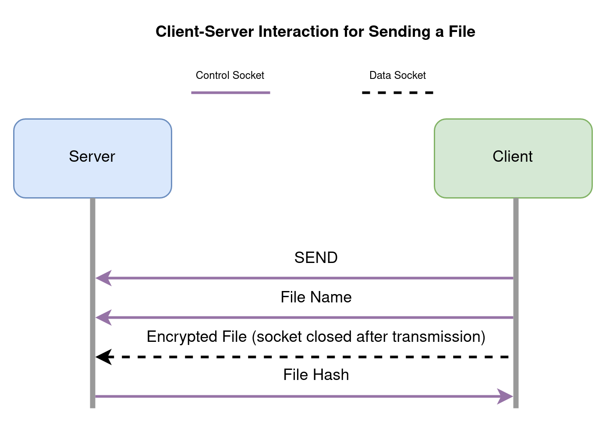

# FileSharer

FileSharer is a command line interface application that enables clients to locally encrypt files, store them on a server, and later retrieve and decrypt them. The purpose of the application is to provide a low-trust file storage solution. That is, since files are encrypted before the server receives them, a client can rely on cryptography rather than trusting that the server will not view the contents of their files.

The image below shows an example run of the application. It demonstrates the four commands available to the client: sending, listing, deleting, and requesting files.

The rest of this README contains the following sections:

 * [Project Design](#project-design)
   * [Project Architecture](#project-architecture)
   * [Protocol Overview](#protocol-overview)
     * [High Level Overview](#high-level-overview)
     * [The Send Command](#the-send-command)
     * [The Request Command](#the-request-command)
     * [The List Command](#the-list-command)
     * [The Delete Command](#the-delete-command)
   * [Encryption Overview](#encryption-overview)
 * [Tech Stack](#tech-stack)
 * [Usage Options and Requirements](#usage-options-and-requirements)
 * [Web Browser Usage Instructions](#web-browser-usage-instructions)
 * [Docker Usage Instructions](#docker-usage-instructions)
 * [Command Line Usage Instructions](#command-line-usage-instructions)
   * [Running the Server](#running-the-server)
   * [Using the Client](#using-the-client)
     * [Sending Files](#sending-files)
     * [Listing Files](#listing-files)
     * [Requesting Files](#requesting-files)
     * [Deleting Files](#deleting-files)
   * [Generating a New Key for the Client (Optional)](#generating-a-new-key-for-the-client-optional)
   * [Building the Application (Optional)](#building-the-application-optional)
 * [Configuring the Application](#configuring-the-application)
 * [Listing of Scripts](#listing-of-scripts)

# Project Design

## Project Architecture

The image below shows the architecture of the application. It consists of a client and server that exchange commands and metadata over a control socket and encrypted files over a data socket. Both the client and server store and retrieve data from their file systems. The client uses AES-128 in CBC mode with a locally stored key to encrypt and decrypt its files as well as a SHA-256 hash to verify correct data transmission and integrity. The application also includes a key manager, which allows users to generate and store a key.

## Protocol Overview

### High Level Overview
The custom application-level protocol is built on top of TCP/IP and borrows some ideas from FTP.

[As with FTP](https://www.w3.org/Protocols/rfc959/2_Overview.html), communication is split over separate control and data sockets. The control socket uses TLS 1.3 and allows the client and server to authenticate each other and thereafter communicate with encrypted, authenticated commands and metadata. However, it would be computationally wasteful to re-encrypt the client's files, so these are sent over a plain TCP socket and authenticated over the control socket.

As in [FTP streaming mode](https://www.w3.org/Protocols/rfc959/3_DataTransfer.html), the data port is closed after a file is sent over it. The client and server stream files to each other and use buffers for file IO, so there is no explicit file size limitation. However, the server does indicate the existence of a file and the successful deletion of a file with its size in bytes using a Java `long`. This creates a file size limitation, however, it far exceeds the typical disk capacity of personal computers.

The image below shows a high level sequence diagram of the application-level protocol. The client connects to the server, and they take part in a TLS 1.3 handshake over the control socket. If this succeeds, the client can send encrypted commands and metadata over the control socket and locally-encrypted files over the data socket. When the client wishes to disconnect, it sends a disconnect message to the server.

### The Send Command

The image below shows a sequence diagram for the send command. The client notifies the server it has data to send and tells it the name of the file it is sending over the control socket. Then, it connects the data socket, sends the file over it, and closes that socket. To ensure that the server has received all data and to ensure that it has not been tampered with by a machine in the middle, the server sends a hash of the encrypted file over the control socket. The client then checks that this hash matches what it sent and notifies the user of the result.

### The Request Command

The image below shows a sequence diagram for the request command. The client notifies the server it is requesting a file and provides it with the file name over the control socket. If it exists, the server responds with its non-negative size in bytes over the control socket. It then transmits the file over the data socket and a hash of the file over the control socket. The client notifies the user if the hash received from the server and the computed hash of the received file do not match.

### The List Command

The image below shows a sequence diagram of the list command. Since there are only commands and metadata to send, it occurs entirely over the control socket. The client notifies the server it would like a list of all stored files and the server responds with a listing of files.

### The Delete Command

The image below shows the sequence diagram of the delete command. Since there are only commands and metadata to send, it occurs entirely over the control socket. The client notifies the server it would like to delete a file and provides it with the file name. The server responds with the size in bytes of the deleted file or a negative number if the file could not be deleted.

## Encryption Overview

The client encrypts and decrypts its files with AES 128 in CBC mode. A 128-bit key is secure [(at least through 2030 according to NIST)](https://nvlpubs.nist.gov/nistpubs/SpecialPublications/NIST.SP.800-57pt1r5.pdf) and results in faster encryption compared to a larger key size. Although CBC is susceptible to padding oracle attacks, this is not a problem in this instance since the client is the only one decrypting data, and it does not share the result of this process with anyone.

Since CBC does not ensure message integrity, the protocol requires a SHA-256 hash of the encrypted data to be sent over the secure control socket. This allows the receiver to compare hashes and ensure that all data has been transmitted and has not been tampered with.

# Tech Stack

The application is written entirely in Scala. It does not depend on any frameworks or libraries aside from the Scala and Java standard libraries. It uses cryptographic primitives from [javax.crypto](https://docs.oracle.com/javase/8/docs/api/javax/crypto/package-summary.html) and [java.security](https://docs.oracle.com/en/java/javase/11/docs/api/java.base/java/security/Security.html) as well as a TLS 1.3 implementation from [javax.net.ssl](https://docs.oracle.com/en/java/javase/11/docs/api/java.base/javax/net/ssl/package-summary.html).

# Usage Options and Requirements

The application can be used in one of three ways:

  1. [Via the Play With Docker web app](#web-browser-usage-instructions)
       * Only requires a [GitHub](https://github.com/signup) or [Docker](https://hub.docker.com/signup/) account and a web browser
       * Can only transfer files that are within the Docker container
       * Recommended for Windows users
  2. [In a local terminal, via a Docker container](#docker-usage-instructions)
       * Requires [Docker](https://docs.docker.com/engine/install/)
       * Can only transfer files that are within the Docker container
  3. [In a local terminal, via `java` and the `.jar` file](#command-line-usage-instructions)
       * Requires [JDK 17 or higher](https://www.oracle.com/java/technologies/downloads/#java17)
       * Can transfer any local files

# Web Browser Usage Instructions

 1. Navigate to [Play With Docker](https://labs.play-with-docker.com/) in your web browser.
 2. Click `Login` and proceed with your GitHub or Docker account.
 3. Click `Start`.
 3. Click on `ADD NEW INSTANCE`.

 You should see a terminal window in your browser similar to the one below:

 

You can then follow the [Docker Usage Instructions](#docker-usage-instructions) to use the application from that terminal window.

# Docker Usage Instructions

These are command line instructions that assume you are in an environment where Docker is available (e.g. your local machine or Play with Docker).

Pull and run the filesharer docker image in detached mode:

    docker run -d --name filesharer alexgrejuc/filesharer

This will start a container in which the server is running. Next, run a shell within the container:

    docker exec -it filesharer /bin/sh

If successful, you will have shell access in `working-directory` in the container. Your terminal window should resemble the Play With Docker terminal window below:

If it does, the server is running in the background. You can jump to [Using the Client](#using-the-client) to start using the application.

After you are done using the application, escape the container with `Ctrl-D`. Clean up by first stopping the container:

    docker stop filesharer

Then remove it:

    docker rm filesharer

# Command Line Usage Instructions

The following instructions are written with a Unix-like system in mind, but a Windows user should be able to follow along with PowerShell.

Assumptions: you have cloned the repository, and you are in the top-level `filesharer` directory.

The application must be run from within `working-directory`, which contains configuration files and directories needed to run the app. The first step is to navigate there:

    cd working-directory

The following instructions for running the application must be run from `working-directory`.

## Running the Server

Start the server with `java`:

    java -jar filesharer.jar server

This should produce an output similar to:

    Server running with control port 9999, data port 9998
    Server storing files at server/storage, and keystore at server/config/keystore

Enter `CTRL+C` to stop the server.

It is possible that ports 9999 or 9998 may unavailable, in which case the server will produce the following message:

    Error connecting: Address already in use (Bind failed)
    Server stopping execution

One solution is to change the application port configuration. See [Configuring the Application](#configuring-the-application) for more information.

## Using the Client

The server must be online for the client to work. The client accepts four commands: `send`, `list`, `request`, and `delete`. They are described below:

### Sending Files

The syntax for sending files is: `java -jar filesharer.jar client send <file name>*`. For example:

    java -jar filesharer.jar client send client/storage/original/test.txt client/storage/original/test.png

With the configuration in [working-directory/server/config/config](working-directory/server/config/config), the encrypted version of these files will end up in [working-directory/server/storage](working-directory/server/storage).

### Listing Files

To list files stored on the server:

    java -jar filesharer.jar client list

Assuming the previous command sent test.txt and test.png, the output should be:

    Client connected to server at localhost with control port 9999 and data port 9998
    Using trust store at client/config/truststore

    Client requesting list of saved files.

    File Name | Size (bytes)
    -------------------------------
    test.png  | 277792
    test.txt  | 48

    Client disconnected

### Requesting Files

The syntax for requesting files back from the server is: `java -jar filesharer.jar client request (<file name> <path to save file to>)+`. For example:

    java -jar filesharer.jar client request test.txt client/storage/decrypted/test.txt test.png client/storage/decrypted/test.png

This will request the files that were sent with the previous `send` command, decrypt them, and store them at the specified path.

### Deleting Files

The syntax for deleting files on the server side is: `java -jar filesharer.jar client delete <file name>*`. For example:

    java -jar filesharer.jar client delete test.txt test.png

## Generating a New Key for the Client (Optional)

The working-directory already contains an AES-128 key at [working-directory/client/config/key](working-directory/client/config/key). However, if desired, a new one may be created.

First, delete or rename the old key:

    mv client/config/key client/config/oldkey

Then create a new one with:

    java -jar filesharer.jar keygenerator

## Building the Application (Optional)

Since a `.jar` is included with this repository, building is not necessary to run the application. These instructions are provided as an optional step. They must be followed locally rather than from within the Docker container, as it does not contain source code.

To build the application, scala (3.1.1) and the scala build tool, sbt (1.6.2), are required. Both of these can be installed by following the official `cs setup` [instructions](https://www.scala-lang.org/download/).

Afterwards, from the top level filesharer directory, build the project:

    sudo sbt clean assembly

Then place the `.jar` in `working-directory`:

    cp target/scala-3.1.1/FileSharer-assembly-0.jar working-directory/filesharer.jar

The new `.jar` can now be used from within `working-directory` as described above.

# Configuring the Application

The above instructions require running the application from `working-directory`, although this can be changed by modifying the configuration files. The only restriction is that the server must be run from a directory that contains [server/config/config](working-directory/server/config/config) and the client must be run from a directory that contains [client/config/config](working-directory/client/config/config).

Look in [src/main/scala/configuration/Configurator.scala](src/main/scala/configuration/Configurator.scala) for the format of these files.

If the application ports need to be changed, the client and server must be given a matching data port and control port.

With the provided configuration, the server will store its files in [working-directory/server/storage](working-directory/server/storage).

Although the above examples send client files from [working-directory/client/storage/original](working-directory/client/storage/original) and store files in [working-directory/client/storage/decrypted](working-directory/client/storage/decrypted), this is only a convention. There is no configuration to these directories and clients may store and send files from any valid path.

# Listing of Scripts

The following bash scripts may be useful for locally evaluating the application, although they are not necessary for doing so:

1. [setup.sh](setup.sh) - creates the working-directory structure (without the gitkeep directory).
2. [test/test.sh](test/test.sh) - runs the app in typical workflows.
3. [test/stress-test.sh](test/stress-test.sh) - runs some tests of the app in atypical/incorrect workflows.
4. [test/clean.sh](test/clean.sh) - removes server files, client's decrypted files, and server logs produced by the above tests.
